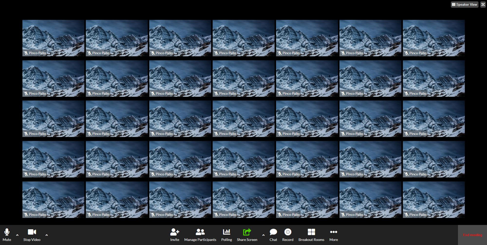

# Boolean Academy - Zoom Call Page
This is a solution to the exercice of - Classe #92 - 09 Febbraio 2023.


## Table of contents

- [Overview](#overview)
  - [The exercice](#the-exercice)
  - [Screenshot](#screenshot)
  - [Links](#links)
- [My process](#my-process)
  - [Built with](#built-with)
  - [What I learned](#what-i-learned)


## Overview

### The exercice

Students should be able to:

- View the optimal layout for the website using CSS Flexbox and Position (Absolute and Relative)
- Set up a single page App

### Screenshot
Below is how the page should looks like




### Links

- Solution URL: [https://github.com/filecc/html-css-zoom](https://github.com/filecc/html-css-zoom)
- Live Site URL: []()

## My process

### Built with

- Semantic HTML5 markup
- CSS custom properties
- Flexbox

### What I learned

We were required to use Flexbox (with no media query and no other framework). I have create some usueful class, like bootstrap, to helmp me in the process.


```html


```

```css

```


