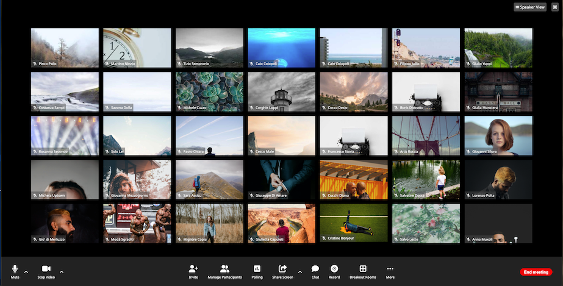

# Boolean Academy - Zoom Call Page
This is a solution to the exercice of - Classe #92 - 09 Febbraio 2023.

## Table of contents

- [Overview](#overview)
  - [The exercice](#the-exercice)
  - [Screenshot](#screenshot)
  - [Links](#links)
- [My process](#my-process)
  - [Built with](#built-with)
  - [What I learned](#what-i-learned)

## Overview

### The exercice

Students should be able to:

- View the optimal layout for the website using CSS Flexbox and Position (Absolute and Relative)
- Set up a single page App

### Screenshot
Below is how the page should looks like

the result:

### Links

- Solution URL: [https://github.com/filecc/html-css-zoom](https://github.com/filecc/html-css-zoom)
- Live Site URL: 

## My process
Most long process, for copyng every row and every single image. I use some random link from [https://picsum.photos/](https://picsum.photos) and from [Unsplash](https://source.unsplash.com/random/900×700/?person), mixing up the API with other words. 

### Built with

- Semantic HTML5 markup
- CSS custom properties
- Flexbox

